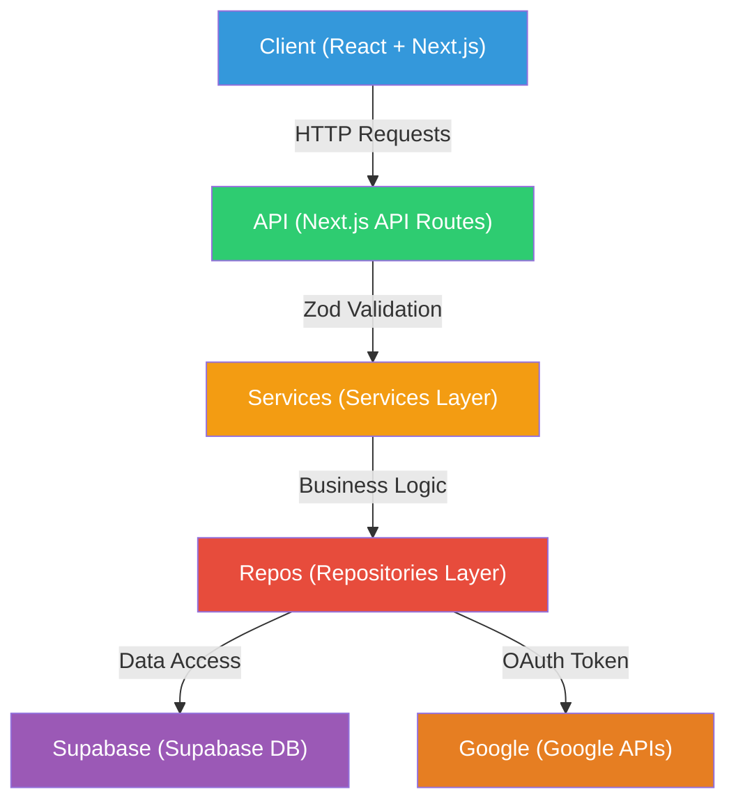
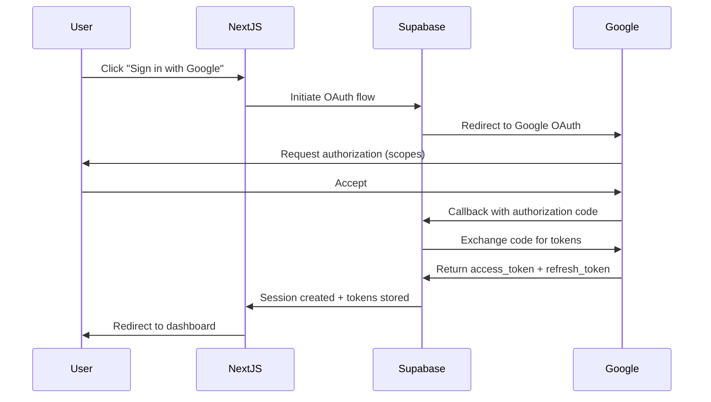
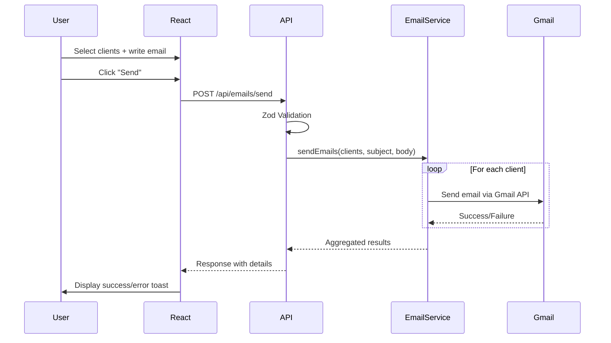
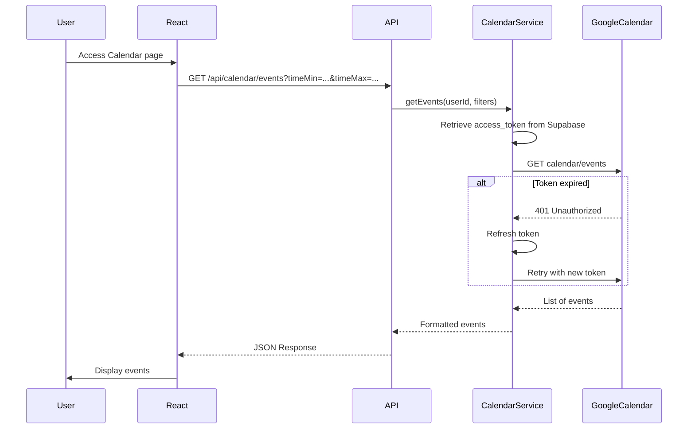

# Technical Test - Client Management Application with Google Authentication

**Tech Stack:** TypeScript • Next.js App Router • React • Supabase • React Query • Zod

**APIs:** Google Calendar API • Gmail API

**Estimated Duration:** 8-12 hours of development

---

## Table of Contents

1. [Project Context](#project-context)
2. [Features to Implement](#features-to-implement)
3. [Architecture and Data Flow](#architecture-and-data-flow)
4. [Detailed Tech Stack](#detailed-tech-stack)
5. [Evaluation Criteria](#evaluation-criteria)
6. [Expected Project Structure](#expected-project-structure)
7. [Delivery Instructions](#delivery-instructions)

---

## 1. Project Context

You need to develop a **full-stack web application** that allows users to:

- Log in via **Google OAuth**
- Synchronize their **Google Calendar** events
- Manage a **client database**
- Send **personalized emails** via Gmail API
- **(Bonus)** Create and use **email templates**

### Evaluation Objectives

This technical test evaluates your skills in:

✅ Modern full-stack architecture with Next.js App Router  
✅ OAuth2 integration and external APIs (Google)  
✅ Client-side state management with React Query  
✅ Database and authentication with Supabase  
✅ Data validation with Zod  
✅ Error handling and security  
✅ Code quality and TypeScript best practices  

---

## 2. Features to Implement

### 2.1. Google Authentication (Required)

#### OAuth2 Login
- Implement authentication via Google with **Supabase Auth**
- Request necessary scopes: `calendar.readonly`, `gmail.send`

#### Token Storage
- Save the `refresh_token` and `access_token` in the Supabase database
- Handle automatic token refresh

#### Route Protection
- Next.js middleware to protect private routes
- Redirect to login page if not authenticated

#### Logout
- Allow users to log out properly
- Invalidate session server-side

---

### 2.2. Google Calendar Synchronization (Required)

#### Event List
- Display events from the user's primary calendar
- Show: title, date/time, description (if available)

#### Filters
- Allow filtering by period:
  - Today
  - This week
  - This month
  - Custom period

#### Refresh
- Button to manually sync with Google Calendar API
- Use React Query to manage cache and refetch

---

### 2.3. Client Management (Required)

#### Full CRUD
- **Create** a new client
- **Read** the list of clients
- **Update** an existing client
- **Delete** a client

#### Required Fields
```typescript
interface Client {
  id: string;
  user_id: string; // Link to the owner user
  name: string; // Required
  email: string; // Required, valid email format
  phone?: string; // Optional
  notes?: string; // Optional
  created_at: Date;
  updated_at: Date;
}
```

#### Validation
- **Client-side** validation with Zod (forms)
- **Server-side** validation with Zod (API routes)
- Clear and specific error messages

#### Ownership
- Each user can only see/modify **their own clients**
- Ownership verification in API routes

---

### 2.4. Sending Emails via Gmail (Required)

#### Send Form
- Interface to **select one or more clients**
- Checkbox for multiple selection

#### Composition
- **Subject** field (required)
- **Message body** field (required, multiline)
- Message preview

#### Gmail API
- Send emails via **Gmail API** using the Google token
- Handle bulk sending (multiple recipients)

#### Feedback
- Display a **success message** with the number of emails sent
- In case of error, display details for each failed email
- Loading state during sending

---

### 2.5. Email Templates (Bonus)

#### CRUD Templates
- Create, read, update, delete email templates
- Fields: template name, subject, body

#### Dynamic Variables
- Support placeholders:
  - `{{client_name}}` → replaced with client's name
  - `{{email}}` → replaced with client's email
  - `{{date}}` → current date

#### Usage
- Ability to select a template when sending an email
- Template automatically fills subject and body
- Ability to edit after selecting a template

---

## 3. Architecture and Data Flow

### 3.1. Global Architecture



### 3.2. Google OAuth Authentication Flow



### 3.3. Email Sending Flow



### 3.4. Calendar Synchronization Flow



---

## 4. Detailed Tech Stack

### 4.1. Frontend

| Technology | Usage | Min Version |
|------------|-------|-------------|
| **TypeScript** | Strict typing (`strict: true`) | 5.0+ |
| **Next.js** | React framework with App Router | 16.0+ |
| **React** | UI Components | 19.2+ |
| **Tanstack / react-query** | Server state management, cache | 5.91+ |
| **Zod** | Schema validation | 3.0+ |
| **Tailwind CSS** | Styling (optional but recommended) | 4.0+ |

### 4.2. Backend

| Technology | Usage |
|------------|-------|
| **Next.js API Routes** | REST endpoints |
| **Supabase** | PostgreSQL Database + Auth |
| **Google Calendar API** | Fetch events |
| **Gmail API** | Send emails |

### 4.3. Database (Supabase)

#### `clients` Table

```sql
CREATE TABLE clients (
  id UUID DEFAULT gen_random_uuid() PRIMARY KEY,
  user_id UUID NOT NULL REFERENCES auth.users(id) ON DELETE CASCADE,
  name TEXT NOT NULL,
  email TEXT NOT NULL,
  phone TEXT,
  notes TEXT,
  created_at TIMESTAMPTZ DEFAULT NOW(),
  updated_at TIMESTAMPTZ DEFAULT NOW()
);
```

### 4.4. Google Cloud Configuration

To use Google APIs, you need to:

1. Create a project on [Google Cloud Console](https://console.cloud.google.com/)
2. Enable the APIs:
   - Google Calendar API
   - Gmail API
3. Configure the OAuth consent screen
4. Create OAuth 2.0 credentials
5. Add the necessary scopes

---

## 5. Evaluation Criteria

### 5.1. TypeScript (Critical - Eliminatory)

| Criterion | Expected |
|-----------|----------|
| **Zero `any`** | Explicit typing everywhere, use `unknown` if needed |
| **Utility types** | Use of `Partial`, `Pick`, `Omit`, `Record` |
| **Generics** | In utility functions and services |
| **Type guards** | For runtime type checking |
| **Inference** | Let TS infer when obvious |

**What we evaluate:**
- Code compiles without errors in strict mode
- No use of `any` type (or minimal and justified)
- Proper use of TypeScript advanced features
- Type safety throughout the application

---

### 5.2. Next.js App Router (Critical - Eliminatory)

| Criterion | Expected |
|-----------|----------|
| **`app/` structure** | Well-organized routes, layouts, pages |
| **API Routes** | `route.ts` with `GET`, `POST`, `PATCH`, `DELETE` |
| **Server vs Client** | Know when to use `"use client"` |
| **Middleware** | Auth redirect, route protection |
| **Error handling** | `error.tsx` for errors, try/catch in API routes |

**What we evaluate:**
- Proper use of App Router conventions
- Server Components vs Client Components distinction
- Error boundaries and error handling

---

### 5.3. React & State Management (Critical - Eliminatory)

| Criterion | Expected |
|-----------|----------|
| **Standard hooks** | `useState`, `useEffect`, `useMemo`, `useCallback` used correctly |
| **React Query v5** | `useQuery`, `useMutation`, `queryKey`, `invalidateQueries` |
| **Optimistic updates** | UI updates before server response (for UX) |
| **placeholderData** | Avoid content flash during refetch |
| **Custom hooks** | Extract reusable logic |

**What we evaluate:**
- Proper React Query usage for server state
- Cache invalidation strategy
- Optimistic updates for better UX
- Custom hooks for code reusability

---

### 5.4. Validation (Zod) (Critical - Eliminatory)

| Criterion | Expected |
|-----------|----------|
| **Basic schemas** | `z.object()`, `z.string()`, `z.number()`, `z.email()` |
| **Advanced validation** | `z.refine()` for cross-field rules |
| **Type inference** | `z.infer<typeof schema>` |
| **Custom messages** | Explicit error messages |

**What we evaluate:**
- Validation on both client and server
- Type inference from schemas
- Clear validation error messages

---

### 5.5. Backend Architecture (Critical)

| Criterion | Expected |
|-----------|----------|
| **Separation of concerns** | Route ≠ Service ≠ Repository |
| **Services** | Business logic, orchestration |
| **Repositories** | Data access only |
| **Clean routes** | Validation + service call + response |
| **Dependency Injection** | Constructor injection, testability |

**What we evaluate:**
- Clear separation between layers
- Services contain business logic
- Repositories handle data access only
- Routes are thin controllers
- Testable architecture

---

### 5.6. Database (Supabase/SQL)

| Criterion | Expected |
|-----------|----------|
| **Supabase queries** | `select`, `insert`, `update`, `delete` |
| **Filters** | `eq`, `in`, `or`, `is`, `gte`, `lte` |
| **No complex JOINs** | Separate queries + JS Maps if needed |
| **Table constants** | No hardcoded strings |
| **Null handling** | Nullish coalescing `??` |

**What we evaluate:**
- Proper use of Supabase client
- Efficient queries without over-fetching
- Error handling for database operations
- Use of constants for table names

---

### 5.7. Security & Permissions (Critical)

| Criterion | Expected |
|-----------|----------|
| **Auth middleware** | Verify session before access |
| **Ownership verification** | User only sees their data |
| **Input validation** | Always validate server-side |
| **Role management** | Differentiate user/admin if relevant |
| **No sensitive data** | Never expose tokens/passwords |

**What we evaluate:**
- Authentication on all protected routes
- Ownership checks in API routes
- No data leaks between users
- Proper HTTP status codes (401, 403, 404)
- Secure token storage

---

### 5.8. Error Handling (Critical)

| Criterion | Expected |
|-----------|----------|
| **Typed errors** | Error classes or error codes |
| **HTTP status codes** | Appropriate 400, 401, 403, 404, 500 |
| **Explicit messages** | Not just "An error occurred" |
| **Try/catch** | Specific catch before generic |
| **Logging** | Structured console (not just `console.log(error)`) |

**What we evaluate:**
- Custom error classes or types
- Proper HTTP status codes
- Clear error messages for users
- Server-side error logging
- Error recovery strategies

---

### 5.9. Tests (Differentiating - Bonus)

| Criterion | Expected |
|-----------|----------|
| **Unit tests** | Vitest, mocking |
| **E2E tests** | Playwright, stable selectors |
| **data-testid** | No fragile text/CSS selectors |
| **Edge cases** | Edge cases, errors |
| **Structure** | Tests mirror code structure |

**What we evaluate:**
- Unit test coverage for critical paths
- E2E tests for main user flows
- Proper mocking of external services
- Edge case coverage

---

### 5.10. Code Quality (Critical)

| Criterion | Expected |
|-----------|----------|
| **Naming** | Explicit variables/functions |
| **Short files** | < 200-300 lines ideally |
| **No duplication** | DRY, extract functions |
| **Comments** | When necessary, not obvious |
| **Conventions** | Consistency throughout project |

**What we evaluate:**
- Code readability
- Consistent naming conventions
- Proper file organization
- Meaningful comments (not redundant)
- Overall code maintainability

---

## 7. Delivery Instructions

### 7.1. Git Repository

1. **Create a public repository** on GitHub
3. **Complete README.md** with:
   - Installation instructions
   - Required environment variables
   - Commands to run the project
   - Screenshots or GIF of the application

### 7.2. Required Files

#### `.env.example`
```bash
# Supabase
SUPABASE_URL=your-supabase-url
...

# Google OAuth (via Supabase)
GOOGLE_CLIENT_ID=your-google-client-id
...
```

### 7.3. Delivery Checklist

Before submitting, ensure:

✅ **Code compiles** without errors with TypeScript strict mode  
✅ **Application runs** on localhost without issues  
✅ **All required features** are implemented and working  
✅ **Clear documentation** for setup and configuration  
✅ **Clean Git commits** with meaningful commit messages  
✅ **No sensitive data** committed (API keys, tokens, etc.)  
✅ **`.env.example`** file provided  
✅ **Dependencies** listed in `package.json`  

---

## Questions?

If you have any questions during the technical test, don't hesitate to contact us by email.

**Good luck! 🚀**